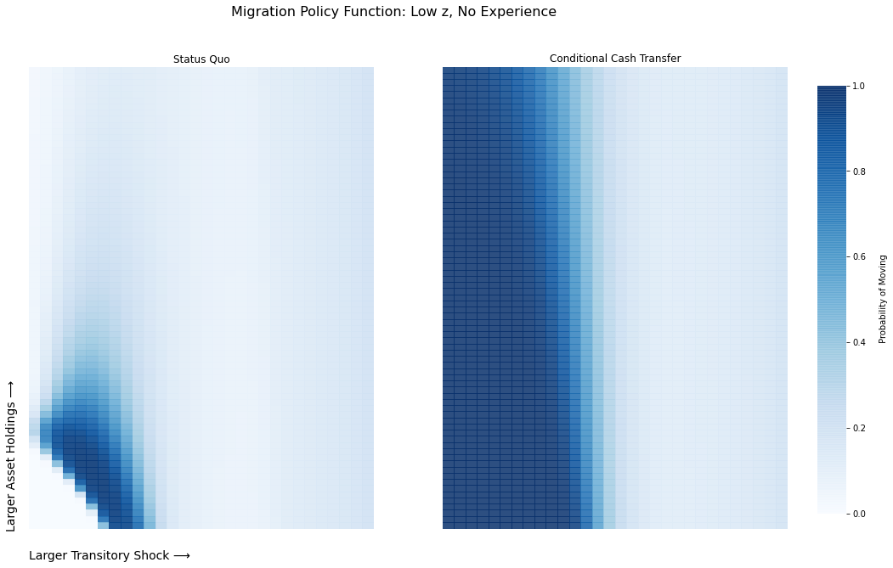

### [The Welfare Effects of Encouraging Rural-Urban Migration](http://www.waugheconomics.com/uploads/2/2/5/6/22563786/LMW.pdf)

---

This repository contains code to reproduce results from the paper ["The Welfare Effects of Encouraging Rural-Urban Migration"](http://www.waugheconomics.com/uploads/2/2/5/6/22563786/LMW.pdf). It also includes replication files (empirical and quantitative results) for the paper ["Underinvestment in a Profitable
Technology: The Case of Seasonal Migration in Bangladesh"](https://onlinelibrary.wiley.com/doi/abs/10.3982/ECTA10489) that were downloaded from Econometrica's code repository and obtained from the authors. I will provide support for the former, not for the later.

**Software Requirements:** Most of this code is in MATLAB and requires the Parallel Computing Toolbox (for computation of the model). Plotting is performed via python. Data analysis is in STATA.

---
The repository is organized with the following folders. The readme file within the folder describes how to execute code:

- **[Calibration](../calibration/)** contains the code to calibrate the model.

- **[Partial equilibrium welfare analysis](../pe_welfare_analysis)** This computes the welfare effects of the one-time transfer. In addition, it outputs results (policy functions, migration rates, etc.) that are plotted in the [plotting folder](../plotting).

- **[General equilibrium welfare analysis](../ge_taxation)** Computes the welfare effects of a permanent transfer financed by taxes and clears the rural labor market.

- **[The efficient allocation](../efficient)** Computes the solution to the planning problem.

- **[Bootstrap](../bootstrap)** computes bootstrap confidence intervals and montecarlo study to explore identification.

- **[Utility functions](../utils)** this folder contains functions that are used throughout all aspects of the code. A complete accounting is found in the readme file.  

- **[Plotting](../plotting)** jupyter notebooks that import MATLAB ``.mat`` files and plots them.

- **[Figures](../utils)** self explanatory. Should all be in `.png` and `.pdf` format.

- **[BCM_code](../BCM_code)** code from Bryan, Chowdhury and Mobarak's ["Underinvestment in a Profitable Technology: The Case of Seasonal Migration in Bangladesh"](https://onlinelibrary.wiley.com/doi/abs/10.3982/ECTA10489)

- **[BCM_econometrica_supplement_files](../BCM_econometrica_supplement_files)** additional files from Bryan, Chowdhury and Mobarak's ["Underinvestment in a Profitable Technology: The Case of Seasonal Migration in Bangladesh"](https://onlinelibrary.wiley.com/doi/abs/10.3982/ECTA10489)
