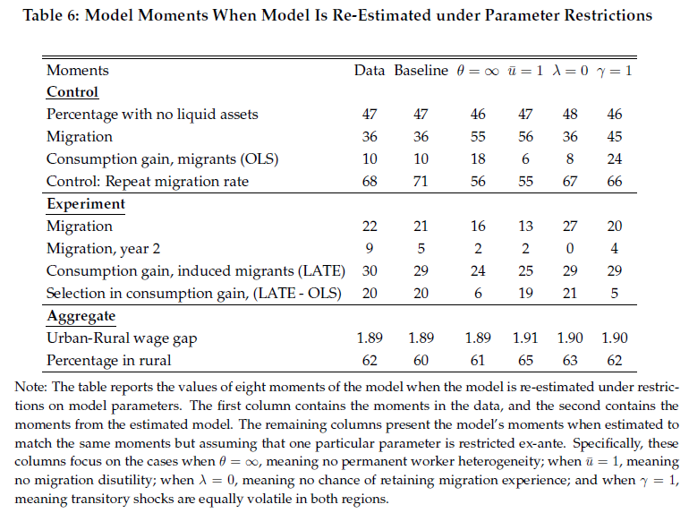

### Appendix

<p align="center">

</p>

This section describes the code that goes into computing Table 6 of the paper and then various checks and alternative calibrations of the model.

---

- [``print_out_param_restriction.m``](./print_out_param_restriction.m) will print out different results when various parameters are restricted to take specific values. Used to create Table 6 in main body of paper.

- [``print_out_appendix.m``](./print_out_appendix.m) will print out all the different results.


- [``compute_outcomes_appendix.m``](./compute_outcomes_appendix.m) is the analog to [``compute_outcomes``](../calibration/compute_outcomes.m) in the calibration folder. Again, setup to handel various permutations.

- [``calibrate_model_appendix.m``](./calibrate_model_appendix.m) is the wrapper file to take in paramters and then return moments or objective function.

- [``compute_outcomes_additive.m``](./compute_outcomes_additive.m) specifically designed for additive utility cost. Calls [``rural_urban_value_additive.m``](../utils/rural_urban_value_additive.m) which solves for the hh problem with the additive utility cost.

- [``preamble_appendix.m``](./preamble_appendix.m) preamble specifically designed for the appendix.


Then there are many files with the following naming convention:

- ``appenix_*`` contains ``.mat`` with the resulting calibrated parameters. For example, ``appendix_cal_low_R.mat`` results from the calibration with an lower $R$.

- ``calibrate_*`` are dirver files that implement the calibration under the given parameter restrictions. They call [``calibrate_model_appendix.m``](./calibrate_model_appendix.m) which is setup to handle various permutations.

- ``welfare_*`` computes the welfare gains associated with alternative parameterizations. **Note** that in some of these files, you must manually go into [``preamble_welfare_analysis.m ``](../pe_welfare_analysis/preamble_welfare_analysis.m ) and implement the correct parameter settings. Instructions are in the files.

---

### Table 6 computations

Below is what the output from [``print_out_param_restriction.m``](./print_out_param_restriction.m) should look like.

```
-----------------------------------------------------------------------------------------------------
   29-Dec-2021 09:16:25


-----------------------------------------------------------------------------------------------------
MATLAB Version: 9.10.0.1739362 (R2021a) Update 5
MATLAB License Number: 618777
Operating System: Microsoft Windows 10 Pro Version 10.0 (Build 19043)
Java Version: Java 1.8.0_202-b08 with Oracle Corporation Java HotSpot(TM) 64-Bit Server VM mixed mode
-----------------------------------------------------------------------------------------------------
MATLAB                                                Version 9.10        (R2021a)
Curve Fitting Toolbox                                 Version 3.5.13      (R2021a)
Econometrics Toolbox                                  Version 5.6         (R2021a)
Financial Instruments Toolbox                         Version 3.2         (R2021a)
Financial Toolbox                                     Version 6.1         (R2021a)
GPU Coder                                             Version 2.1         (R2021a)
Global Optimization Toolbox                           Version 4.5         (R2021a)
MATLAB Coder                                          Version 5.2         (R2021a)
MATLAB Compiler                                       Version 8.2         (R2021a)
MATLAB Compiler SDK                                   Version 6.10        (R2021a)
Optimization Toolbox                                  Version 9.1         (R2021a)
Parallel Computing Toolbox                            Version 7.4         (R2021a)
Partial Differential Equation Toolbox                 Version 3.6         (R2021a)
Statistics and Machine Learning Toolbox               Version 12.1        (R2021a)
-----------------------------------------------------------------------------------------------------

Starting parallel pool (parpool) using the 'local' profile ...
Connected to the parallel pool (number of workers: 24).
Elapsed time is 36.070338 seconds.
%%%%%%%%%%%%%%%%%%%%%%%%%%%%%%%%%%%%%%%%%%%%%%%%%%%%%%%%%%%%%%%%%%%%%%%%%%%
%%%%%%%%%%%%%%%%%%%%%%%%%%%%%%%%%%%%%%%%%%%%%%%%%%%%%%%%%%%%%%%%%%%%%%%%%%%
Baseline Model
    0.0024

    0.4700
    0.3700
    0.1000
    0.7100
    0.2100
    0.0500
    0.2900
    1.8900
    0.6000

%%%%%%%%%%%%%%%%%%%%%%%%%%%%%%%%%%%%%%%%%%%%%%%%%%%%%%%%%%%%%%%%%%%%%%%%%%%
%%%%%%%%%%%%%%%%%%%%%%%%%%%%%%%%%%%%%%%%%%%%%%%%%%%%%%%%%%%%%%%%%%%%%%%%%%%
rho = 0, recalibrate
Objective function: current, as calibrated, baseline
    0.0075    0.0075    0.0024

Moments
    0.4700
    0.3600
    0.1400
    0.7000
    0.2100
    0.0300
    0.2800
    1.8900
    0.5900

%%%%%%%%%%%%%%%%%%%%%%%%%%%%%%%%%%%%%%%%%%%%%%%%%%%%%%%%%%%%%%%%%%%%%%%%%%%
%%%%%%%%%%%%%%%%%%%%%%%%%%%%%%%%%%%%%%%%%%%%%%%%%%%%%%%%%%%%%%%%%%%%%%%%%%%
ubar = 1, recalibrate
Objective function: current, as calibrated, baseline
    0.0794    0.0794    0.0024

Moments
    0.4700
    0.5600
    0.0600
    0.5500
    0.1300
    0.0200
    0.2500
    1.9100
    0.6500

%%%%%%%%%%%%%%%%%%%%%%%%%%%%%%%%%%%%%%%%%%%%%%%%%%%%%%%%%%%%%%%%%%%%%%%%%%%
%%%%%%%%%%%%%%%%%%%%%%%%%%%%%%%%%%%%%%%%%%%%%%%%%%%%%%%%%%%%%%%%%%%%%%%%%%%
lambda = 0, recalibrate
Objective function: current, as calibrated, baseline
    0.2451    0.0036    0.0024

Moments
    0.4900
    0.1700
    0.1100
    0.4000
    0.2200
         0
    0.3100
    2.2300
    0.5900

%%%%%%%%%%%%%%%%%%%%%%%%%%%%%%%%%%%%%%%%%%%%%%%%%%%%%%%%%%%%%%%%%%%%%%%%%%%
%%%%%%%%%%%%%%%%%%%%%%%%%%%%%%%%%%%%%%%%%%%%%%%%%%%%%%%%%%%%%%%%%%%%%%%%%%%
1/theta = 0, recalibrate
Objective function: current, as calibrated, baseline
    0.0751    0.0751    0.0024

Moments
    0.4600
    0.5500
    0.1800
    0.5600
    0.1600
    0.0200
    0.2400
    1.8900
    0.6100

%%%%%%%%%%%%%%%%%%%%%%%%%%%%%%%%%%%%%%%%%%%%%%%%%%%%%%%%%%%%%%%%%%%%%%%%%%%
%%%%%%%%%%%%%%%%%%%%%%%%%%%%%%%%%%%%%%%%%%%%%%%%%%%%%%%%%%%%%%%%%%%%%%%%%%%
gamma = 1, recalibrate
Objective function: current, as calibrated, baseline
    0.0315    0.0315    0.0024

Moments
    0.4600
    0.4500
    0.2400
    0.6600
    0.2000
    0.0400
    0.2900
    1.9000
    0.6200
```
---

### Appendix Computations

Below is what the output from [``print_out_appendix.m``](./print_out_appendix.m) should look like.

```
-----------------------------------------------------------------------------------------------------
   15-Dec-2021 12:22:35


-----------------------------------------------------------------------------------------------------
MATLAB Version: 9.10.0.1739362 (R2021a) Update 5
MATLAB License Number: 618777
Operating System: Microsoft Windows 10 Pro Version 10.0 (Build 19043)
Java Version: Java 1.8.0_202-b08 with Oracle Corporation Java HotSpot(TM) 64-Bit Server VM mixed mode
-----------------------------------------------------------------------------------------------------
MATLAB                                                Version 9.10        (R2021a)
Curve Fitting Toolbox                                 Version 3.5.13      (R2021a)
Econometrics Toolbox                                  Version 5.6         (R2021a)
Financial Instruments Toolbox                         Version 3.2         (R2021a)
Financial Toolbox                                     Version 6.1         (R2021a)
GPU Coder                                             Version 2.1         (R2021a)
Global Optimization Toolbox                           Version 4.5         (R2021a)
MATLAB Coder                                          Version 5.2         (R2021a)
MATLAB Compiler                                       Version 8.2         (R2021a)
MATLAB Compiler SDK                                   Version 6.10        (R2021a)
Optimization Toolbox                                  Version 9.1         (R2021a)
Parallel Computing Toolbox                            Version 7.4         (R2021a)
Partial Differential Equation Toolbox                 Version 3.6         (R2021a)
Statistics and Machine Learning Toolbox               Version 12.1        (R2021a)
-----------------------------------------------------------------------------------------------------

Elapsed time is 13.277473 seconds.
%%%%%%%%%%%%%%%%%%%%%%%%%%%%%%%%%%%%%%%%%%%%%%%%%%%%%%%%%%%%%%%%%%%%%%%%%%%
%%%%%%%%%%%%%%%%%%%%%%%%%%%%%%%%%%%%%%%%%%%%%%%%%%%%%%%%%%%%%%%%%%%%%%%%%%%
Baseline Model
    0.0024

    0.1800
    0.4700
    0.3700
    0.1000
    0.2100
    0.0500
    0.2900
    0.7100
    1.8900
    0.6000
    0.6600

%%%%%%%%%%%%%%%%%%%%%%%%%%%%%%%%%%%%%%%%%%%%%%%%%%%%%%%%%%%%%%%%%%%%%%%%%%%
%%%%%%%%%%%%%%%%%%%%%%%%%%%%%%%%%%%%%%%%%%%%%%%%%%%%%%%%%%%%%%%%%%%%%%%%%%%
Low R, just change R, not recalibrate
Objective function: current, baseline
    0.1026    0.0024

Moments
    0.1800
    0.7800
    0.3900
    0.0600
    0.2000
    0.0500
    0.3000
    0.7100
    1.8700
    0.5900
    0.6600

%%%%%%%%%%%%%%%%%%%%%%%%%%%%%%%%%%%%%%%%%%%%%%%%%%%%%%%%%%%%%%%%%%%%%%%%%%%
%%%%%%%%%%%%%%%%%%%%%%%%%%%%%%%%%%%%%%%%%%%%%%%%%%%%%%%%%%%%%%%%%%%%%%%%%%%
High R, just change R, not recalibrate
Objective function: current, baseline
    0.0660    0.0024

Moments
    0.1700
    0.2300
    0.3200
    0.1200
    0.2000
    0.0400
    0.2600
    0.6900
    1.9300
    0.6200
    0.6700

%%%%%%%%%%%%%%%%%%%%%%%%%%%%%%%%%%%%%%%%%%%%%%%%%%%%%%%%%%%%%%%%%%%%%%%%%%%
%%%%%%%%%%%%%%%%%%%%%%%%%%%%%%%%%%%%%%%%%%%%%%%%%%%%%%%%%%%%%%%%%%%%%%%%%%%
    0.9700

High beta, just change beta, not recalibrate
Objective function: current, baseline
    0.0114    0.0024

Moments
    0.1800
    0.3800
    0.3600
    0.1100
    0.2100
    0.0500
    0.2800
    0.7100
    1.8800
    0.6000
    0.6600

%%%%%%%%%%%%%%%%%%%%%%%%%%%%%%%%%%%%%%%%%%%%%%%%%%%%%%%%%%%%%%%%%%%%%%%%%%%
%%%%%%%%%%%%%%%%%%%%%%%%%%%%%%%%%%%%%%%%%%%%%%%%%%%%%%%%%%%%%%%%%%%%%%%%%%%
    0.9000

Low beta, just change beta, not recalibrate
Objective function: current, baseline
    0.1041    0.0024

Moments
    0.1900
    0.7900
    0.3700
    0.0700
    0.2100
    0.0500
    0.3000
    0.7000
    1.9300
    0.6200
    0.6600

%%%%%%%%%%%%%%%%%%%%%%%%%%%%%%%%%%%%%%%%%%%%%%%%%%%%%%%%%%%%%%%%%%%%%%%%%%%
%%%%%%%%%%%%%%%%%%%%%%%%%%%%%%%%%%%%%%%%%%%%%%%%%%%%%%%%%%%%%%%%%%%%%%%%%%%
    0.0878

Subsistence, recalibrate
Objective function: current, as calibrated, baseline
    0.0032    0.0032    0.0024

Moments
    0.1600
    0.4700
    0.3600
    0.0900
    0.2000
    0.0400
    0.3100
    0.7000
    1.8900
    0.6000
    0.6200

%%%%%%%%%%%%%%%%%%%%%%%%%%%%%%%%%%%%%%%%%%%%%%%%%%%%%%%%%%%%%%%%%%%%%%%%%%%
%%%%%%%%%%%%%%%%%%%%%%%%%%%%%%%%%%%%%%%%%%%%%%%%%%%%%%%%%%%%%%%%%%%%%%%%%%%
    0.1756

Subsistence High, recalibrate
Objective function: current, as calibrated, baseline
    0.0029    0.0029    0.0024

Moments
    0.1400
    0.4700
    0.3700
    0.1000
    0.2100
    0.0400
    0.3000
    0.7000
    1.8900
    0.6000
    0.5900

%%%%%%%%%%%%%%%%%%%%%%%%%%%%%%%%%%%%%%%%%%%%%%%%%%%%%%%%%%%%%%%%%%%%%%%%%%%
%%%%%%%%%%%%%%%%%%%%%%%%%%%%%%%%%%%%%%%%%%%%%%%%%%%%%%%%%%%%%%%%%%%%%%%%%%%
    0.0878

Perm Moving Cost, recalibrate
Objective function: current, as calibrated, baseline
    0.0047    0.0047    0.0024

Moments
    0.1800
    0.4800
    0.3800
    0.1300
    0.2200
    0.0600
    0.2600
    0.6900
    1.9000
    0.6000
    0.7000

%%%%%%%%%%%%%%%%%%%%%%%%%%%%%%%%%%%%%%%%%%%%%%%%%%%%%%%%%%%%%%%%%%%%%%%%%%%
%%%%%%%%%%%%%%%%%%%%%%%%%%%%%%%%%%%%%%%%%%%%%%%%%%%%%%%%%%%%%%%%%%%%%%%%%%%
rho = 0, recalibrate
Objective function: current, as calibrated, baseline
    0.0075    0.0075    0.0024

Moments
    0.1400
    0.4700
    0.3600
    0.1400
    0.2100
    0.0300
    0.2800
    0.7000
    1.8900
    0.5900
    0.5400

%%%%%%%%%%%%%%%%%%%%%%%%%%%%%%%%%%%%%%%%%%%%%%%%%%%%%%%%%%%%%%%%%%%%%%%%%%%
%%%%%%%%%%%%%%%%%%%%%%%%%%%%%%%%%%%%%%%%%%%%%%%%%%%%%%%%%%%%%%%%%%%%%%%%%%%
ubar = 1, recalibrate
Objective function: current, as calibrated, baseline
    0.0794    0.0794    0.0024

Moments
    0.2100
    0.4700
    0.5600
    0.0600
    0.1300
    0.0200
    0.2500
    0.5500
    1.9100
    0.6500
    0.7600

%%%%%%%%%%%%%%%%%%%%%%%%%%%%%%%%%%%%%%%%%%%%%%%%%%%%%%%%%%%%%%%%%%%%%%%%%%%
%%%%%%%%%%%%%%%%%%%%%%%%%%%%%%%%%%%%%%%%%%%%%%%%%%%%%%%%%%%%%%%%%%%%%%%%%%%
Additive Migration Utility Cost, recalibrate
Objective fucntion: current, as calibrated, baseline
    0.0171    0.0171    0.0024

Moments
    0.2000
    0.4700
    0.3900
    0.0800
    0.1300
    0.0400
    0.2500
    0.6800
    1.9100
    0.5700
    0.7300
```
