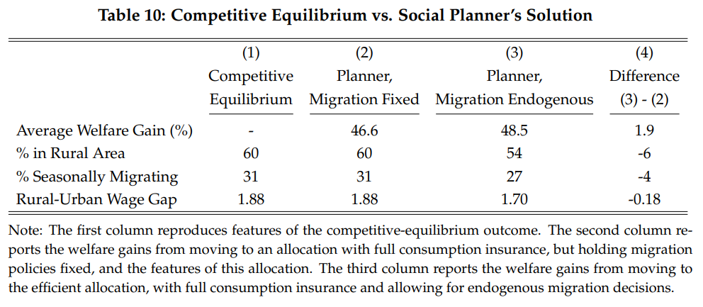

### Computing the Efficient Allocation


<p align="center">

</p>


This section describes computations to compute the efficient allocation.

---

### Main Computation

The most basic call starts inside the [``efficient``](../efficient) folder. To perform the analysis you:

```
>> solve_efficient
```

which does several things.

  - First it replicates the baseline economy.

  - Second, it keeps policy functions fixed and then redistributes output to equate the marginal utility of consumption across all households for all states, dates, and locations. This is the "full insurance" benchmark. Aggregates in this section should match up with baseline economy, the only difference is the allocation of consumption.

  - Third, it then solves for the efficient allocation according to Proposition 1 which both (i) equates the marginal utility of consumption and (ii) optimally moves households across space.

  - In the driver file there is a parameter ``pareto_alpha`` for which one can control the Pareto weights by permanent type; when set equal to zero the weights are equal, when negative more weight is put on higher ability types and vice versa.  

The output should look something like this.

```
-----------------------------------------------------------------------------------------------------
   17-Jan-2023 22:33:31

 
-----------------------------------------------------------------------------------------------------
MATLAB Version: 9.10.0.1739362 (R2021a) Update 5
MATLAB License Number: 618777
Operating System: Microsoft Windows 10 Pro Version 10.0 (Build 19045)
Java Version: Java 1.8.0_202-b08 with Oracle Corporation Java HotSpot(TM) 64-Bit Server VM mixed mode
-----------------------------------------------------------------------------------------------------
MATLAB                                                Version 9.10        (R2021a)
Curve Fitting Toolbox                                 Version 3.5.13      (R2021a)
Econometrics Toolbox                                  Version 5.6         (R2021a)
Financial Instruments Toolbox                         Version 3.2         (R2021a)
Financial Toolbox                                     Version 6.1         (R2021a)
GPU Coder                                             Version 2.1         (R2021a)
Global Optimization Toolbox                           Version 4.5         (R2021a)
MATLAB Coder                                          Version 5.2         (R2021a)
MATLAB Compiler                                       Version 8.2         (R2021a)
MATLAB Compiler SDK                                   Version 6.10        (R2021a)
Optimization Toolbox                                  Version 9.1         (R2021a)
Parallel Computing Toolbox                            Version 7.4         (R2021a)
Partial Differential Equation Toolbox                 Version 3.6         (R2021a)
Statistics and Machine Learning Toolbox               Version 12.1        (R2021a)
-----------------------------------------------------------------------------------------------------
 
%%%%%%%%%%%%%%%%%%%%%%%%%%%%%%%%%%%%%%%%%%%%%%%%%%%%%%%%%%%%%%%%%%%%
Replicating the baseline economy...
%%%%%%%%%%%%%%%%%%%%%%%%%%%%%%%%%%%%%%%%%%%%%%%%%%%%%%%%%%%%%%%%%%%%
Aggregate Statistics
Average Rural Population
    0.5987

Migrants, Mushfiqs Sample
    0.3647

Migrants, Whole Population
    0.3067

Wage Gap
    1.8923

Fraction of Rural with Access to Migration Subsidy
    0.4975

Mushfiqs Sample, Average Welfare
   -1.3587

Social Welfare: All, Rural, Urban
   -1.0800   -1.2900   -0.7700

Gov Budget Constraint
     0

Tax rate in % on labor income
     0


                                         Norm of      First-order 
 Iteration  Func-count     f(x)          step          optimality
     0          5        0.235563                         0.478
     1         10     6.22104e-23       0.483999        7.8e-12      

Equation solved.

fsolve completed because the vector of function values is near zero
as measured by the value of the function tolerance, and
the problem appears regular as measured by the gradient.

<stopping criteria details>
Elapsed time is 135.281898 seconds.
%%%%%%%%%%%%%%%%%%%%%%%%%%%%%%%%%%%%%%%%%%%%%%%%%%%%%%%%%%%%%%%%%%%%
Aggregate Statistics
Average Rural Population
    0.5987

Seasonal Migrants
    0.3067

Social Welfare: All, Rural, Urban
   -0.7382   -0.7404   -0.7350

Standard Deviation of Marginal Utility
   1.0e-15 *

    0.6106    0.0312

Implied Wage Gap
    1.8923

Accounting
Monga: Production, Consumption, Moving Costs, Utility Cost
    0.9500    0.9445    0.0056    0.0292

Not Monga: Production, Consumption, Moving Costs, Utility Costs
    1.5010    1.4793    0.0217    0.0027

Resource Constraint: Monga, Non Monga
   1.0e-11 *

   -0.1254    0.7787

Al, Welfare Gain in %: From Decentralized to Full Insurance, Fixed Allocation
   46.5935

%%%%%%%%%%%%%%%%%%%%%%%%%%%%%%%%%%%%%%%%%%%%%%%%%%%%%%%%%%%%%%%%%%%%
Now compute the efficient allocation...

                                         Norm of      First-order 
 Iteration  Func-count     f(x)          step          optimality
     0          9         4.53024                          2.03
     1         18       0.0172834        1.87004          0.154      
     2         27     0.000133247      0.0780257         0.0114      
     3         36        1.52e-07      0.0073141       0.000423      
     4         45     1.03748e-10    0.000295335       1.12e-05      

Equation solved, inaccuracy possible.

fsolve stopped because the vector of function values is near zero, as measured by the value
of the function tolerance. However, the last step was ineffective.

<stopping criteria details>
Elapsed time is 239.841492 seconds.
%%%%%%%%%%%%%%%%%%%%%%%%%%%%%%%%%%%%%%%%%%%%%%%%%%%%%%%%%%%%%%%%%%%%
Aggregate Statistics
Average Rural Population
    0.5365

Seasonal Migrants
    0.2681

Social Welfare: All, Rural, Urban
   -0.7290   -0.7266   -0.7318

Standard Deviation of Marginal Utility
   1.0e-14 *

    0.1062    0.0368

Implied Wage Gap
    1.7043

%%%%%%%%%%%%%%%%%%%%%%%%%%%%%%%%%%%%%%%%%%%%%%%%%%%%%%%%%%%%%%%%%%%%
Accounting
Monga: Production, Consumption, Moving Costs, Utility Costs
    0.9604    0.9517    0.0088    0.0286

Not Monga: Production, Consumption, Moving Costs, Utility Costs
    1.4883    1.4661    0.0222    0.0055

Resource Constraint: Monga, Non Monga
   1.0e-05 *

    0.7327   -0.5546

Welfare Gain in %: From Decentralized to Centralized/Efficient Allocation
   48.4504

Welfare Gain in %: From Full Insurance to Centralized/Efficient Allocation
    1.8568

```

As mentioned above, the first set of results replicates the baseline economy. If this is not matching up with expectations, then there is a problem somewhere.

The second set of results then computes the full insurance benchmark. This is executed in [``compute_fullinsurance``](./compute_fullinsurance.m)

The third set of results are the aggregates and welfare gains from the efficient allocation. This is executed in [``compute_analytical_efficient.m``](./compute_analytical_efficient.m)

---

### Accounting

Several components are here. One is the [full insurance allocation.](#code-for-full-insurance) The other is the [efficient allocation.](#code-for-efficient-allocation) The code that goes into each component is discussed in turn.

- [``solve_efficient.m``](./solve_efficient.m) main driver file.

#### Code for full insurance

- [``compute_fullinsurance.m``](./compute_fullinsurance.m) computes the full insurance benchmark.

- [`` policy_valuefun_fullinsurance.m``](./policy_valuefun_fullinsurance.m) solves for the value function associated with full insurance, yet migration policy functions are used from the baseline economy, so the labor allocation resulting from this should be exactly the same as in the baseline economy.

- [``quick_sim_fullinsurance.m``](./quick_sim_fullinsurance.m) function to take states from full simulation in [``just_simmulate``](../utils/just_simulate.m) and extract outcomes.

- [``fullinsurance_aggregate.m``](./fullinsurance_aggregate.m) function to take panel of outcomes and aggregate and report statistics.

- [``tax_eq_preamble.m``](./tax_eq_preamble.m) this unfortunately is a hack to load the proper settings in the [``just_policy.m``](../utils/just_policy.m) function that is called. It then loads this local preamble.

---

#### Code for efficient allocation

- [``compute_analytical_efficient.m``](./compute_analytical_efficient.m) main driver file that takes primitives and then computes the efficient allocation.

- [``efficient_aggregate.m``](./efficient_aggregate.m) code to aggregate the efficient allocation.

- [``efficient_chi.m``](./efficient_chi.m) this is where it takes the guessed marginal utility of consumption and marginal product of labor, guesses a $\chi$'s which given the recursive formulation maps into a new $\chi$, then value-function-like iteration is used until the $\chi$'s converge and the migration probabilities are recovered.

- [``efficient_chi_policy.m``](./efficient_chi_policy.m) wrapper file to construct the $\chi$ multipliers for each permanent productivity state.

- [``efficient_policy.m``](./efficient_policy.m) wrapper file to take the migration probabilities and consumption allocation and then compute value functions for households of different states and the marginal utility of consumption.

- [``efficient_preamble.m``](./efficient_preamble.m) preamble file to set things up.

- [``efficient_simulate.m``](./efficient_simulate.m) wrapper file to simulate and construct the allocation.

- [``efficient_valuefun.m``](./efficient_valuefun.m) computes value functions for households given optimal decision rules.

- [``make_weights.m``](./fullinsurance_aggregate.m) constructs Pareto weights.

- [``onestep.m``](./onestep.m) takes some guessed values for consumption by season and then mpl by season and computes the allocation.

- [``quick_sim_efficient.m``](./quick_sim_efficient.m) quick simulation routine that takes states from [``efficient_simulate.m``](./efficient_simulate.m) and then returns outcomes. 

- [``quick_sim_fullinsurance.m``](./quick_sim_fullinsurance.m) same idea but for full insurance benchmark. 

- [``simulate_efficient.m``](./simulate_efficient.m) core file to simulate the model.

- [``solve_efficient.m``](./solve_efficient.m) runs everything (replicates benchmark, full insurance, efficient).

- [``preamble.m``](./preamble.m) main preamble file to set things up called by [``efficient_preamble.m``](./efficient_preamble.m).


