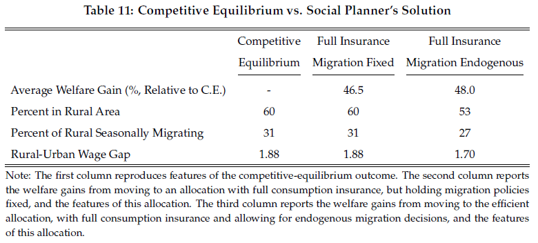

### Computing the Efficient Allocation


<p align="center">

</p>


This section describes computations to compute the efficient allocation.

---

### Main Computation

The most basic call starts inside the [``efficient``](../efficient) folder. To perform the analysis you:

```
>> solve_efficient
```

which does several things.

  - First it replicates the baseline economy.

  - Second, it keeps policy functions fixed and then redistributes output to equate the marginal utility of consumption across all households for all states, dates, and locations. This is the "full insurance" benchmark. Aggregates in this section should match up with baseline economy, the only difference is the allocation of consumption.

  - Third, it then solves for the efficient allocation accoring to Proposition 1 which both (i) equates the marginal utility of consumption and (ii) optimally moves households across space.

The output should look something like this.

```
-----------------------------------------------------------------------------------------------------
   14-Dec-2021 09:56:44


-----------------------------------------------------------------------------------------------------
MATLAB Version: 9.4.0.813654 (R2018a)
MATLAB License Number: 13347
Operating System: Microsoft Windows 10 Pro for Workstations Version 10.0 (Build 19042)
Java Version: Java 1.8.0_144-b01 with Oracle Corporation Java HotSpot(TM) 64-Bit Server VM mixed mode
-----------------------------------------------------------------------------------------------------
MATLAB                                                Version 9.4         (R2018a)
Control System Toolbox                                Version 10.4        (R2018a)
Curve Fitting Toolbox                                 Version 3.5.7       (R2018a)
Econometrics Toolbox                                  Version 5.0         (R2018a)
Financial Instruments Toolbox                         Version 2.7         (R2018a)
Financial Toolbox                                     Version 5.11        (R2018a)
Global Optimization Toolbox                           Version 3.4.4       (R2018a)
Optimization Toolbox                                  Version 8.1         (R2018a)
Parallel Computing Toolbox                            Version 6.12        (R2018a)
Signal Processing Toolbox                             Version 8.0         (R2018a)
Statistics and Machine Learning Toolbox               Version 11.3        (R2018a)
Symbolic Math Toolbox                                 Version 8.1         (R2018a)
-----------------------------------------------------------------------------------------------------

%%%%%%%%%%%%%%%%%%%%%%%%%%%%%%%%%%%%%%%%%%%%%%%%%%%%%%%%%%%%%%%%%%%%
Replicating the baseline economy...
%%%%%%%%%%%%%%%%%%%%%%%%%%%%%%%%%%%%%%%%%%%%%%%%%%%%%%%%%%%%%%%%%%%%
Aggregate Statistics
Average Rural Population
    0.5978

Migrants, Mushfiqs Sample
    0.3651

Migrants, Whole Population
    0.3048

Wage Gap
    1.8835

Fraction of Rural with Access to Migration Subsidy
    0.4961

Mushfiqs Sample, Average Welfare (% ce variation)
  -32.6178

Social Welfare (% ce variation): All, Rural, Urban
  -25.9700  -30.9900  -18.5100

Gov Budget Constraint
     0

Tax rate in % on labor income
     0

%%%%%%%%%%%%%%%%%%%%%%%%%%%%%%%%%%%%%%%%%%%%%%%%%%%%%%%%%%%%%%%%%%%%
Fix the labor allocation, but redistribute and equate marginal utility of consumption across hh...
%%%%%%%%%%%%%%%%%%%%%%%%%%%%%%%%%%%%%%%%%%%%%%%%%%%%%%%%%%%%%%%%%%%%
Aggregate Statistics
Average Rural Population
    0.5978

Seasonal Migrants
    0.3048

Experince
    0.2434

Social Welfare: All, Rural, Urban
  -17.7287  -17.7814  -17.6505

Standard Deviation of Marginal Utility
   1.0e-13 *

    0.1887    0.4346

Implied Wage Gap
    1.8835

%%%%%%%%%%%%%%%%%%%%%%%%%%%%%%%%%%%%%%%%%%%%%%%%%%%%%%%%%%%%%%%%%%%%
Accounting
Monga: Production, Consumption, Moving Costs, Utility Cost
    0.9478    0.9423    0.0056    0.0288

Not Monga: Production, Consumption, Moving Costs, Utility Costs
    1.5030    1.4814    0.0216    0.0027

Resource Constraint: Monga, Non Monga
   1.0e-11 *

    0.0651    0.1543

Al, Welfare Gain in %: From Decentralized to Full Insurance, Fixed Allocation
   46.4918

%%%%%%%%%%%%%%%%%%%%%%%%%%%%%%%%%%%%%%%%%%%%%%%%%%%%%%%%%%%%%%%%%%%%
Now compute the efficient allocation...

                                         Norm of      First-order
 Iteration  Func-count     f(x)          step          optimality
     0          9       0.0459826                         0.209
     1         18     9.69047e-06       0.202449        0.00352      
     2         27     8.32301e-09       0.002891       0.000102      
     3         36     3.17639e-10     6.6785e-05       1.92e-05      

Equation solved, inaccuracy possible.

The vector of function values is near zero, as measured by the default value
of the function tolerance. However, the last step was ineffective.

<stopping criteria details>

Elapsed time is 58.661386 seconds.
%%%%%%%%%%%%%%%%%%%%%%%%%%%%%%%%%%%%%%%%%%%%%%%%%%%%%%%%%%%%%%%%%%%%
Aggregate Statistics
Average Rural Population
    0.5337

Seasonal Migrants
    0.2658

Social Welfare: All, Rural, Urban
  -17.5409  -17.4844  -17.6056

Standard Deviation of Marginal Utility
   1.0e-13 *

    0.6573    0.7328

Implied Wage Gap
    1.6950

%%%%%%%%%%%%%%%%%%%%%%%%%%%%%%%%%%%%%%%%%%%%%%%%%%%%%%%%%%%%%%%%%%%%
Accounting
Monga: Production, Consumption, Moving Costs, Utility Costs
    0.9557    0.9472    0.0085    0.0280

Not Monga: Production, Consumption, Moving Costs, Utility Costs
    1.4883    1.4665    0.0218    0.0054

Resource Constraint: Monga, Non Monga
   1.0e-04 *

    0.0510    0.1557

Welfare Gain in %: From Decentralized to Centralized/Efficient Allocation
   48.0603

Welfare Gain in %: From Full Insurance to Centralized/Efficient Allocation
    1.5685

```

As mentioned above, the first set of results replicates the baseline economy. If this is not matching up with expectations, then there is a problem somewhere.

The second set of results then computes the full insurance benchmark. This is executed in [``compute_fullinsurance``](./compute_fullinsurance.m)

The third set of results are the aggregates and welfare gains from the efficient allocation. This is executed in [``compute_analytical_efficient.m``](./compute_analytical_efficient.m)

---

### Accounting

Several components are here. One is the [full insurance allocation.](#code-for-full-insurance) The other is the [efficient allocation.](#code-for-efficient-allocation) The code that goes into each component is discussed in turn.

- [``solve_efficient.m``](./solve_efficient.m) main driver file.

#### Code for full insurance

- [``compute_fullinsurance.m``](./compute_fullinsurance.m) computes the full insurance benchmark.

- [`` policy_valuefun_fullinsurance.m``](./policy_valuefun_fullinsurance.m) solves for the value function associated with full insurance, yet migration policy functions are used from the baseline economy, so the labor allocation resulting from this should be exactly the same as in the baseline economy.

- [``quick_sim_fullinsurance.m``](./quick_sim_fullinsurance.m) function to take states from full simulation in [``just_simmulate``](../utils/just_simulate.m) and extract outcomes.

- [``fullinsurance_aggregate.m``](./fullinsurance_aggregate.m) function to take panel of outcomes and aggregate and report statistics.

- [``tax_eq_preamble.m``](./tax_eq_preamble.m) this unfortunatly is a hack to load the proper settings in the [``just_policy.m``](../utils/just_policy.m) function that is called. It then loads this local preamble.

---

#### Code for efficient allocation

- [``compute_analytical_efficient.m``](./compute_analytical_efficient.m) main driver file that takes primitives and then computes the efficient allocation.

- [``efficient_preamble.m``](./efficient_preamble.m) preamble file to set things up.

- [``onestep.m``](./onestep.m) takes some guessed values for consumption by season and then mpl by season and computes the allocation.

- [``efficient_chi_policy.m``](./efficient_chi_policy.m) wrapper file to construct the $\chi$ multipliers for each permanent productivity state.

- [``efficient_chi.m``](./efficient_chi.m) this is where it takes the guessed marginal utility of consumption and marginal product of labor, guesses a $\chi$'s which given the recursive formulation maps into a new $\chi$, then value-function-like iteration is used until the $\chi$'s converge and the migration probabilities are recovered.

- [``efficient_policy.m``](./efficient_policy.m) wrapper file to take the migration probabilities and consumption allocation and then compute value functions for households of different states and the marginal utility of consumption.

- [``efficient_valuefun.m``](./efficient_valuefun.m) computes value functions for households given optimal decision rules.

- [``efficient_simulate.m``](./efficient_simulate.m) wrapper file to simulate and construct the allocation.

- [``simulate_efficient.m``](./simulate_efficient.m) core file to simulate the model.

- [``quick_sim_efficient.m``](./quick_sim_efficient.m) quick simulation routine that takes states from [``efficient_simulate.m``](./efficient_simulate.m) and then returns outcomes.  

- [``efficient_aggregate.m``](./efficient_aggregate.m) file to aggregate from the simulation results.
